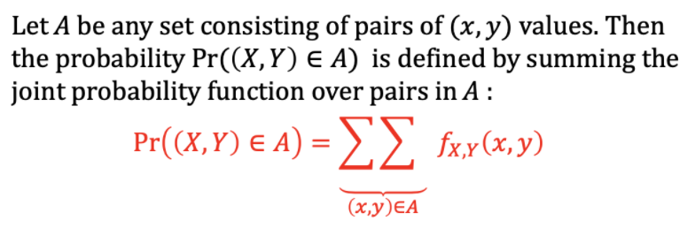
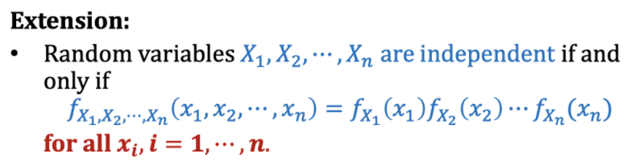
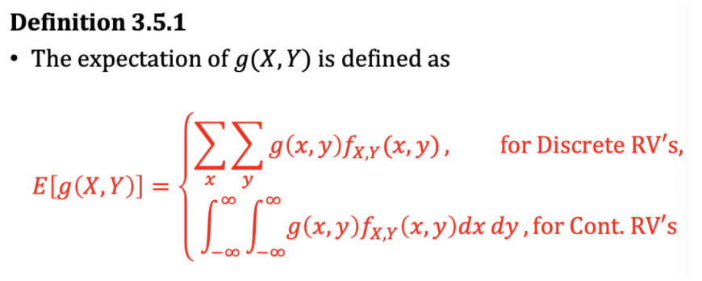

# Chapter 3: Two Dimensional RV and Conditional Probabilty Distributions

## Two Dimensional Random Variables

Let E be an experiment and S a sample space associated with E.

Let *X and Y* be **two functions each assigning a real number to each $s\in S$**

> (X,Y) is a **two-dimensional random variable** (or **random vector**)

&nbsp

### Range Space

$ R_{X,Y}=\{(x,y) | x=X(s),y=Y(s),s\in S\} $

> Let $X_1,X_2,\cdots ,X_n$ be n functions each assigning a real number to *<u>every outcome</u>* $s\in S$. We call ($X_1,X_2,\cdots ,X_n$) an **n-dimensional random variable** (or an **n-dimensional random vector**)
> 1. (X,Y) is a two-dimensional **discrete** RV if the possible values of (X(s),Y(s)) are **finite or countable infinite**
> 2. (X,Y) is a two-dimensional **continuous** RV if the possible values of (X(s),Y(s)) can **assume all values in some region of the Euclidean plane $\R^2$**

&nbsp

## Joint Probability Density Function

### Joint Probability Function for Discrete RVs

Let (X,Y) be a 2-dimensional discrete random variable defined on the sample space of an experiment. With each possible value ($x_i,y_j$), we associate a number $f_{X,Y}(x_i,y_j)$ representing Pr($X=x_i,Y=y_j$) and satisfying the following conditions:

1. $f_{X,Y}(x_i,y_j)\geq 0$ for all $(x_i,y_j)\in R_{X,Y}$
2. $\sum^\infin_{i=1}\sum^\infin_{j=1}f_{X,Y}(x_i,y_j)=\sum^\infin_{i=1}\sum^\infin_{j=1}Pr(X=x_i,Y=y_j)=1$

The function $f_{X,Y}(x,y)$ defined for all pairs of values $(x_i,y_j)\in R_{X,Y}$ is called the joint probability function of (X,Y).

&nbsp

### Joint pdf for Continuous RVs

Let (X,Y) be a two-dimensional **continuous** RV **assuming all values in some region $\R$ of the Euclidean plane $\R^2$**

$f_{X,Y}(x,y)$ is called a joint probability density function if it satisfies the following conditions:

> 1. $f_{X,Y}(x,y)\geq 0$ $(x,y)\in R_{X,Y}$

> 2. $\int\int_{(x,y)\in R_{X,Y}}f_{X,Y}(x,y)dxdy=1$ or $\int^\infin_{-\infin}\int^\infin_{-\infin}f_{X,Y}(x,y)dxdy=1$

&nbsp

## Marginal and Conditional Probability Distributions

### Marginal Probability Distributions

Let (X,Y) be a 2-dimensional discrete (or continuous) RV with joint probability function (or joint pdf) $f_{X,Y}(x,y)$

For **discrete**: $f_X(x)=\sum_yf_{X,Y}(x,y)$ and $f_Y(y)=\sum_xf_{X,Y}(x,y)$

For **continuous**: $f_X(x)=\int^\infin_{-\infin}f_{X,Y}(x,y)dy$ and $f_Y(y)=\int^\infin_{-\infin}f_{X,Y}(x,y)dy$

&nbsp

### Conditional Distribution

Let (X,Y) be a discrete (or continuous) 2-dimensional RV with joint pdf $f_{X,Y}(x,y)$

Let $f_x(x)$ and $f_Y(y)$ be the marginal pdf of X and Y respectively

> **Conditional distribution of Y given X = x**
>
> **$f_{Y|X}(y|x)=\frac{f_{X,Y}(x,y)}{f_X(x)}, \text{if}f_X(x)>0$**
>
> **for each x within the range of X**

> **Similarly, conditional distribution of X given Y = y**
>
> **$f_{X|Y}(x|y)=\frac{f_{X,Y}(x,y)}{f_Y(y)}, \text{if}f_Y(y)>0$**
>
> **for each y within the range of Y**

Remarks:

1. conditional pdfs satisfy all requirements for a 1-dimentional pdf. Thus,
    - For a fixed y, $f_{X|Y}(x|y)\geq0$. For a fixed x, $f_{Y|X}(y|x)\geq0$
    - For discrete RV: $\sum_xf_{X|Y}(x|y)=1$ and $\sum_yf_{Y|X}(y|x)=1$
    - For continuous RV: $\sum_{-\infin}^\infin f_{X|Y}(x|y)=1$ and $\sum_{-\infin}^\infin f_{Y|X}(y|x)=1$

2. For $f_Y(y)>0$, $f_{X,Y}(x,y)=f_{X|Y}(x|y)f_Y(y)$
3. For $f_X(x)>0$, $f_{X,Y}(x,y)=f_{Y|X}(y|x)f_X(x)$

&nbsp

## Independent Random Variable

> RV X and Y are **independent** **<u>*iff*</u>** $f_{X,Y}(x,y)=f_X(x)f_Y(y)$ for all x,y

Remark:

Product of 2 positive dunctions $f_X(x)$ and $f_Y(y)$ means a function which is positive on a product space.

i.e. **IF** $f_X(x)>0,\text{for }x\in A_1$ **AND** $f_Y(y)>0,\text{for }y\in A_2 $
$\rightarrow f_X(x)f_Y(y)>0, \text{for (x,y)}\in A_1 X A_2$ 

&nbsp

## Expectation

### Special Case

Let $g(X,Y)=(X-\mu_X)(Y-\mu_Y)$. This leads to the definition of covariance between 2 random variables.

> Let (X,Y) be a **bivariate random vector** with joint pdf $f_{X,Y}(x,y)$, then the **covariance** of (X,Y) is defined as $Cov(X,Y)=E[(X-\mu_X)(Y-\mu_Y)]$

#### Discrete case

$Cov(X,Y)=E[(X-\mu_X)(Y-\mu_Y)]$

​				  	$=\sum_x \sum_y (x-\mu_X)(y-\mu_Y)f_{X,Y}(x,y)dx\ dy$

#### Continuous case

$Cov(X,Y)=E[(X-\mu_X)(Y-\mu_Y)]$

​				  	$=\int^\infin_{-\infin} \int^\infin_{-\infin} (x-\mu_X)(y-\mu_Y)f_{X,Y}(x,y)dx\ dy$

#### Remarks

1. $Cov(X,Y)=E(XY)-\mu_X \mu_Y$
2. If X and Y are **independent**, then *<u>Cov(X,Y) = 0</u>*. **NOT vice versa** 

3. $Cov(aX+b,cY+d)=ac\ Cov(X,Y)$
4. $V(aX+bY)=a^2V(X)+b^2V(Y)+2ab\ Cov(X,Y)$

&nbsp

### Correlation coefficient

> Correlation coefficient of X and Y, denoted by $Cor(X,Y),\rho_{X,Y}\ or\ \rho$ os defined by
> $$
> \rho_{X,Y}=\frac{Cov(X,Y)}{\sqrt{V(X)}\sqrt{V(Y)}}
> $$

Remarks:

1. $-1\leq \rho_{X,Y}\leq1$
2. $\rho_{X,Y}$ is a measure of degree of linear relationship between X and Y
3. If X and Y are independent, then $\rho_{X,Y}=0$ **n*ot vice versa***
